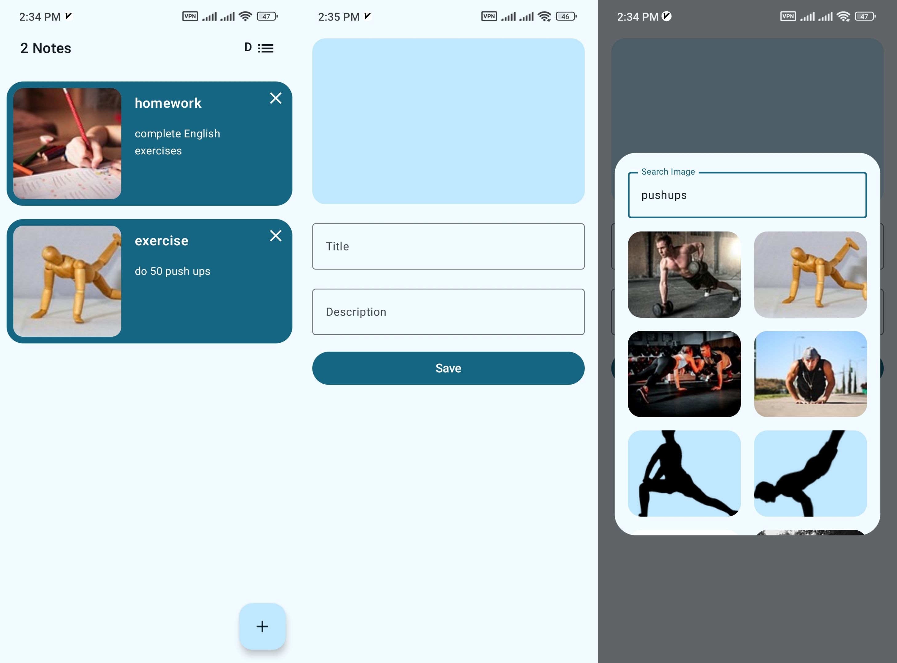
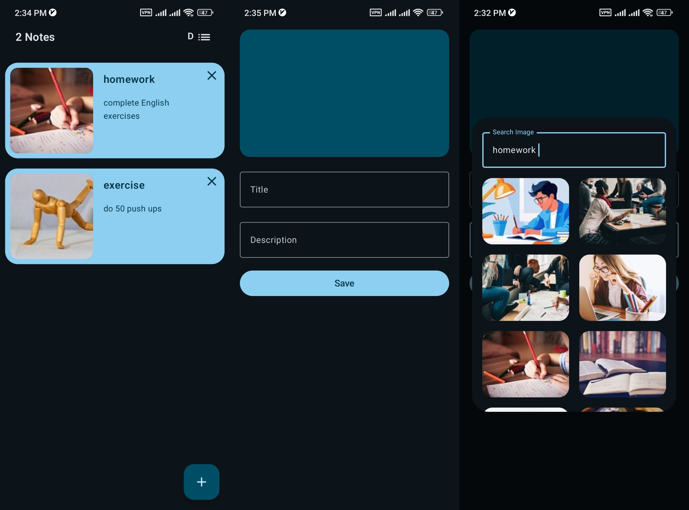

# Description

 📓 Notebook App – A modern Android note-taking app built with Jetpack Compose, Room, Retrofit, and Hilt.
 Implements MVI architecture and follows Clean Architecture principles for scalability and testability.
 Image loading powered by Coil, with offline-first support using Room.
 Clean, reactive UI with unidirectional data flow for a smooth user experience.

# Preview

